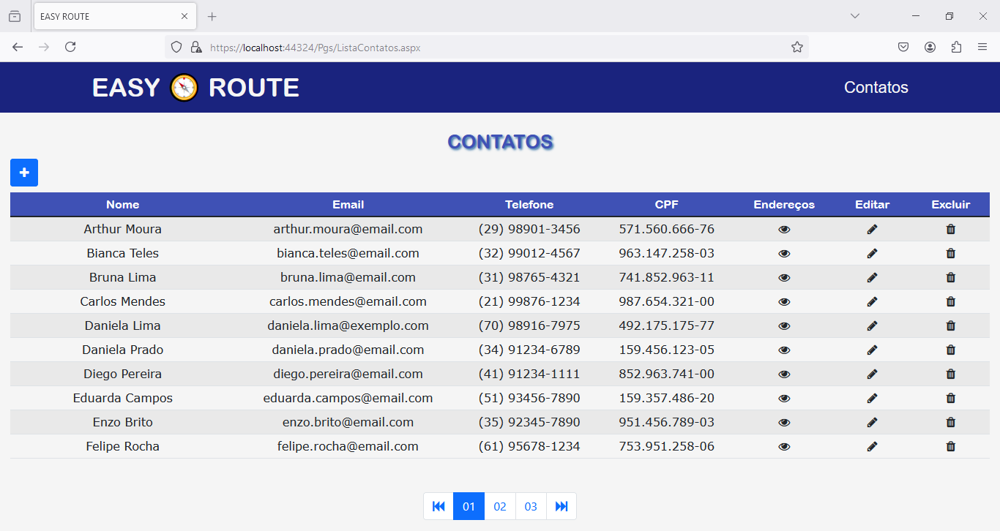
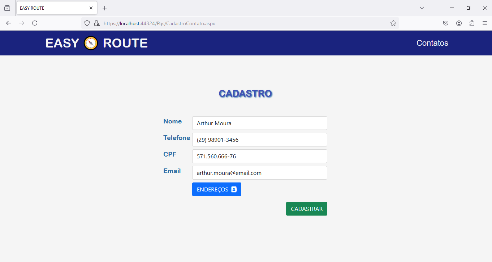
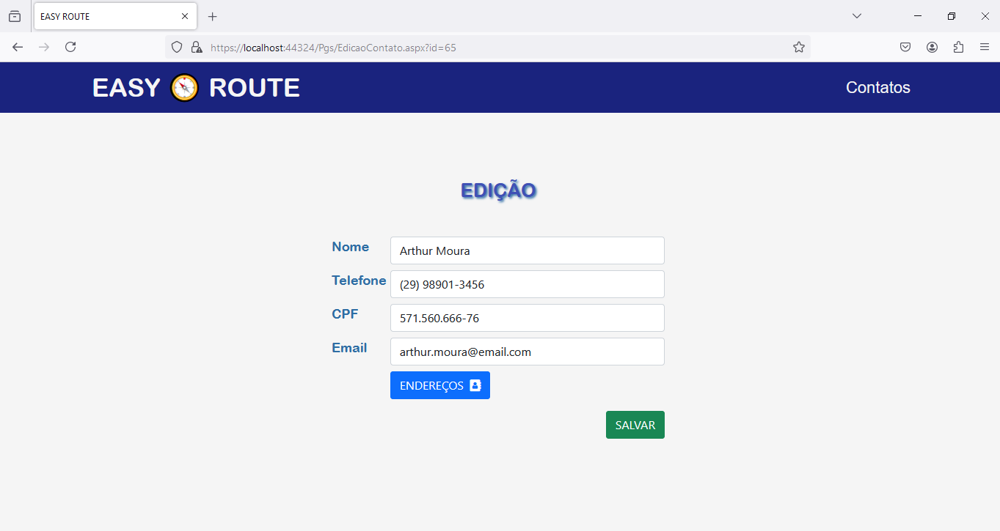
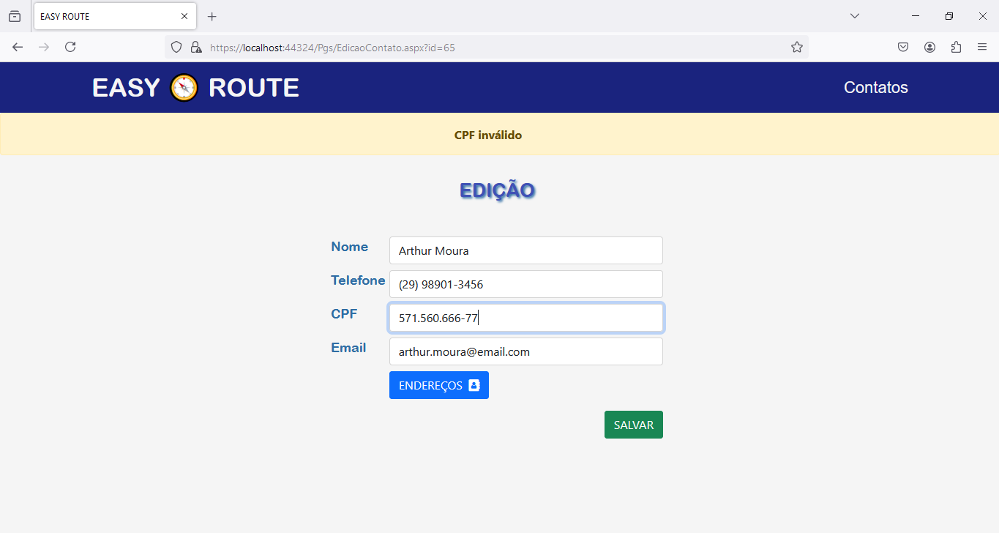
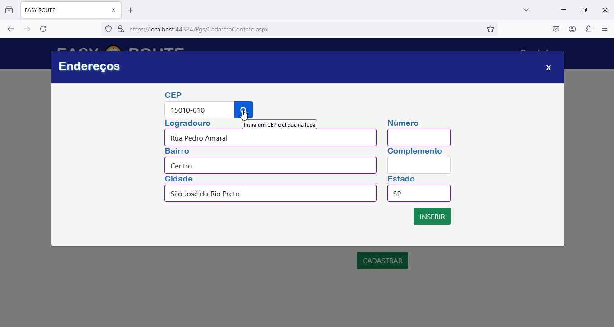
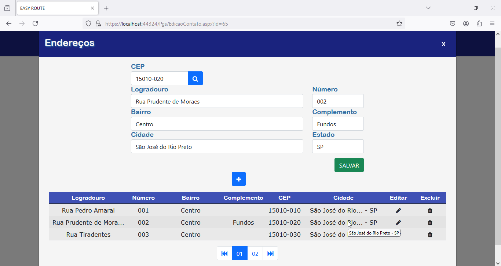

# EasyRoute

## **Descrição do Projeto**

O **EasyRoute** é um sistema web desenvolvido em ASP.NET WebForms com C#, criado para gerenciar contatos e seus respectivos endereços. Seu objetivo principal é oferecer uma plataforma simples, eficiente e intuitiva para cadastro, edição e listagem de contatos, permitindo o gerenciamento de múltiplos endereços por pessoa.

---

## **Funcionalidades Implementadas**

✅ Cadastro de novos contatos com formulário validado  
✅ Edição de contatos existentes com recuperação automática dos dados  
✅ Inclusão e listagem de múltiplos endereços por contato  
✅ Validação de campos (ex: CPF, Email)  
✅ Consulta automática de endereço pelo CEP via API ViaCEP  
✅ Página de listagem com paginação  
✅ Feedback ao usuário com alertas amigáveis   
✅ Design responsivo com Bootstrap e Font Awesome  
✅ Reuso de componentes via UserControls

---

📂 **Estrutura do Projeto**

```  

EasyRoute/
├── Css/               # Estilos personalizados 
├── Css-Lib/           # Bibliotecas de estilo (Bootstrap, Font Awesome)
├── Js/                # Scripts principais do sistema 
├── Js-Lib/            # Bibliotecas JS externas (jQuery, Noty, Mask, SmartPaginator)
├── Handlers/          # Arquivos .ashx para processamento 
├── Pgs/               # Páginas .aspx do sistema
├── Uc/                # UserControls .ascx reutilizáveis
├── Utils/             # Utilitários e métodos auxiliares
├── Imgs/              # Imagens do sistema 
├── Sql/               # Arquivos .sql de criação do banco, tabelas e inserts fictícios
├── EasyRoute.dbml     # Mapeamento LINQ to SQL
└── EasyRoute.Master   # Master Page para layout principal

```

## **Imagens do Sistema**

### Lista de Contatos com Paginação


### Tela de Cadastro de Contato


### Edição de Contato


### Validação de CPF


### Tela de Cadastro de Endereço


### Edição de Endereço


---

🛠️ **Tecnologias Utilizadas**

- **C# ASP.NET WebForms**
- **LINQ to SQL**
- **JavaScript / jQuery**
- **Bootstrap**
- **Font Awesome**
- **Noty.js**
- **jQuery Mask / tmpl / paginator**
- **ViaCEP API**

---

💻 **Requisitos**

- Visual Studio 2015 ou superior
- .NET Framework (recomendado 4.7.2)
- SQL Server ou LocalDB
- IIS Express ou IIS local
